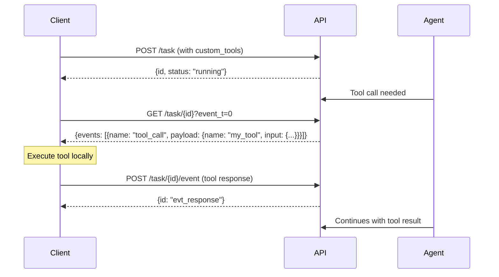

Custom tools allow you to extend the agent's capabilities by registering functions that it can call during execution. When the agent needs to perform an action that your tool provides, it will pause and wait for you to execute the tool and return the result.

## How Custom Tools Work

1. **Register tools** when creating a task via the `custom_tools` parameter
2. **Poll for tool calls** - the agent sends `tool_call` events when it needs to use a tool
3. **Execute the tool** locally and return the result via the Event endpoint
4. **Agent continues** with the tool's output



## Step 1: Define Your Tools

When creating a task, define your custom tools using the `custom_tools` parameter:

```bash
curl -X POST "https://api.smooth.sh/api/v1/task" \
     -H "Content-Type: application/json" \
     -H "apikey: YOUR_API_KEY" \
     -d '{
       "task": "Look up the weather in New York and send me a summary via Slack",
       "custom_tools": [
         {
           "name": "get_weather",
           "description": "Get the current weather for a city. Use this when you need weather information.",
           "inputs": {
             "type": "object",
             "properties": {
               "city": {
                 "type": "string",
                 "description": "The city name"
               }
             },
             "required": ["city"]
           },
           "output": "Weather information as a JSON object with temperature, conditions, and humidity"
         },
         {
           "name": "send_slack_message",
           "description": "Send a message to a Slack channel. Use this to notify the user.",
           "inputs": {
             "type": "object",
             "properties": {
               "channel": {
                 "type": "string",
                 "description": "The Slack channel name"
               },
               "message": {
                 "type": "string",
                 "description": "The message to send"
               }
             },
             "required": ["channel", "message"]
           },
           "output": "Boolean indicating success"
         }
       ]
     }'
```

### Tool Definition Schema

| Field | Type | Required | Description |
|-------|------|----------|-------------|
| `name` | string | Yes | Unique identifier for the tool |
| `description` | string | Yes | Explains what the tool does and when to use it |
| `inputs` | object | Yes | JSON Schema describing the input parameters |
| `output` | string | Yes | Description of what the tool returns |

## Step 2: Poll for Tool Calls

When the agent needs to call one of your tools, it emits a `tool_call` event. Poll the task endpoint to receive these events:

```bash
curl -X GET "https://api.smooth.sh/api/v1/task/task_abc123?event_t=0" \
     -H "apikey: YOUR_API_KEY"
```

**Response with tool call:**

```json
{
  "r": {
    "id": "task_abc123",
    "status": "running",
    "events": [
      {
        "id": "tc_weather_001",
        "name": "tool_call",
        "payload": {
          "name": "get_weather",
          "input": {
            "city": "New York"
          }
        },
        "timestamp": 1699999999999
      }
    ]
  }
}
```

**Important:** The `id` field in the event is crucial - you'll use it to send the response.

## Step 3: Execute and Respond

Execute the tool locally, then send the result back via the Event endpoint:

```bash
curl -X POST "https://api.smooth.sh/api/v1/task/task_abc123/event" \
     -H "Content-Type: application/json" \
     -H "apikey: YOUR_API_KEY" \
     -d '{
       "name": "tool_call",
       "payload": {
         "code": 200,
         "output": {
           "temperature": 72,
           "conditions": "Partly cloudy",
           "humidity": 45
         }
       },
       "id": "tc_weather_001"
     }'
```

### Response Format

| Field | Type | Description |
|-------|------|-------------|
| `name` | string | Must be `"tool_call"` |
| `id` | string | **Must match** the event ID from the tool call |
| `payload.code` | number | `200` for success, `400` or `500` for errors |
| `payload.output` | any | The tool's result (or error message) |

### Handling Errors

If your tool fails, return an error:

```bash
curl -X POST "https://api.smooth.sh/api/v1/task/task_abc123/event" \
     -H "Content-Type: application/json" \
     -H "apikey: YOUR_API_KEY" \
     -d '{
       "name": "tool_call",
       "payload": {
         "code": 400,
         "output": "City not found: New Yrok"
       },
       "id": "tc_weather_001"
     }'
```

The agent will receive the error and may try again with corrected input or take an alternative approach.

## Complete Example: Weather Bot

Here's a complete implementation that handles custom tool calls:

```javascript
const API_KEY = 'YOUR_API_KEY';
const BASE_URL = 'https://api.smooth.sh/api/v1';

// Define your tool implementations
const toolImplementations = {
  async get_weather({ city }) {
    // In reality, you'd call a weather API
    const weatherData = {
      'New York': { temperature: 72, conditions: 'Partly cloudy', humidity: 45 },
      'London': { temperature: 58, conditions: 'Rainy', humidity: 80 },
      'Tokyo': { temperature: 68, conditions: 'Clear', humidity: 55 }
    };

    const weather = weatherData[city];
    if (!weather) {
      throw new Error(`Weather data not available for: ${city}`);
    }
    return weather;
  },

  async send_slack_message({ channel, message }) {
    // In reality, you'd use the Slack API
    console.log(`[Slack #${channel}] ${message}`);
    return true;
  }
};

async function request(method, path, body = null) {
  const response = await fetch(`${BASE_URL}${path}`, {
    method,
    headers: {
      'apikey': API_KEY,
      'Content-Type': 'application/json'
    },
    body: body ? JSON.stringify(body) : null
  });
  return response.json();
}

async function handleToolCall(taskId, event) {
  const { name, input } = event.payload;
  console.log(`Tool called: ${name}`, input);

  let response;
  try {
    const implementation = toolImplementations[name];
    if (!implementation) {
      throw new Error(`Unknown tool: ${name}`);
    }

    const output = await implementation(input);
    response = { code: 200, output };
  } catch (error) {
    response = { code: 400, output: error.message };
  }

  // Send the response
  await request('POST', `/task/${taskId}/event`, {
    name: 'tool_call',
    payload: response,
    id: event.id
  });

  console.log(`Tool response sent for ${name}:`, response);
}

async function runTaskWithTools() {
  // Create task with custom tools
  const { r: task } = await request('POST', '/task', {
    task: 'Look up the weather in New York and send a summary to the #general Slack channel',
    custom_tools: [
      {
        name: 'get_weather',
        description: 'Get current weather for a city',
        inputs: {
          type: 'object',
          properties: {
            city: { type: 'string', description: 'The city name' }
          },
          required: ['city']
        },
        output: 'Weather data with temperature, conditions, humidity'
      },
      {
        name: 'send_slack_message',
        description: 'Send a message to a Slack channel',
        inputs: {
          type: 'object',
          properties: {
            channel: { type: 'string', description: 'Channel name' },
            message: { type: 'string', description: 'Message to send' }
          },
          required: ['channel', 'message']
        },
        output: 'Boolean indicating success'
      }
    ]
  });

  console.log(`Task created: ${task.id}`);
  console.log(`Live URL: ${task.live_url}`);

  // Poll and handle tool calls
  let lastEventT = 0;
  const processedEvents = new Set();

  while (true) {
    const { r: taskStatus } = await request('GET', `/task/${task.id}?event_t=${lastEventT}`);

    // Check if task is done
    if (!['running', 'waiting'].includes(taskStatus.status)) {
      console.log(`Task finished with status: ${taskStatus.status}`);
      console.log('Output:', taskStatus.output);
      break;
    }

    // Process tool calls
    if (taskStatus.events) {
      for (const event of taskStatus.events) {
        if (event.name === 'tool_call' && !processedEvents.has(event.id)) {
          processedEvents.add(event.id);
          await handleToolCall(task.id, event);
        }
      }
      lastEventT = taskStatus.events[taskStatus.events.length - 1].timestamp;
    }

    await new Promise(r => setTimeout(r, 1000));
  }
}

runTaskWithTools().catch(console.error);
```

## Using with Sessions

Custom tools work the same way with session workflows. Define them when creating the session:

```bash
curl -X POST "https://api.smooth.sh/api/v1/task" \
     -H "Content-Type: application/json" \
     -H "apikey: YOUR_API_KEY" \
     -d '{
       "task": null,
       "url": "https://example.com",
       "custom_tools": [
         {
           "name": "save_to_database",
           "description": "Save extracted data to the database",
           "inputs": {
             "type": "object",
             "properties": {
               "data": { "type": "object" },
               "table": { "type": "string" }
             },
             "required": ["data", "table"]
           },
           "output": "The saved record ID"
         }
       ]
     }'
```

Then when running tasks within the session, the agent can use your custom tools:

```bash
curl -X POST "https://api.smooth.sh/api/v1/task/task_abc123/event" \
     -H "Content-Type: application/json" \
     -H "apikey: YOUR_API_KEY" \
     -d '{
       "name": "session_action",
       "payload": {
         "name": "run_task",
         "input": {
           "task": "Extract all products from this page and save them to the products database table"
         }
       },
       "id": "evt_task_001"
     }'
```

## Python SDK Example

The SDK provides a decorator-based approach for custom tools:

```python
from smooth import SmoothClient, tool

client = SmoothClient(api_key="YOUR_API_KEY")

@tool
def get_weather(city: str) -> dict:
    """Get current weather for a city.

    Args:
        city: The city name to get weather for

    Returns:
        Weather data with temperature, conditions, humidity
    """
    # Your weather API call here
    return {
        "temperature": 72,
        "conditions": "Partly cloudy",
        "humidity": 45
    }

@tool
def send_slack_message(channel: str, message: str) -> bool:
    """Send a message to a Slack channel.

    Args:
        channel: The Slack channel name
        message: The message to send

    Returns:
        True if message was sent successfully
    """
    # Your Slack API call here
    print(f"[Slack #{channel}] {message}")
    return True

# The SDK handles polling and tool execution automatically
task = client.run(
    task="Look up the weather in New York and send a summary to #general",
    tools=[get_weather, send_slack_message]
)

result = task.result()
print(f"Task output: {result.output}")
```

## Best Practices

1. **Write clear descriptions** - The agent uses descriptions to decide when to call your tool
2. **Define complete schemas** - Include all required fields and descriptions for each input
3. **Handle errors gracefully** - Return meaningful error messages so the agent can recover
4. **Set appropriate timeouts** - Long-running tools should be async with proper timeout handling
5. **Validate inputs** - Check that required fields are present before executing
