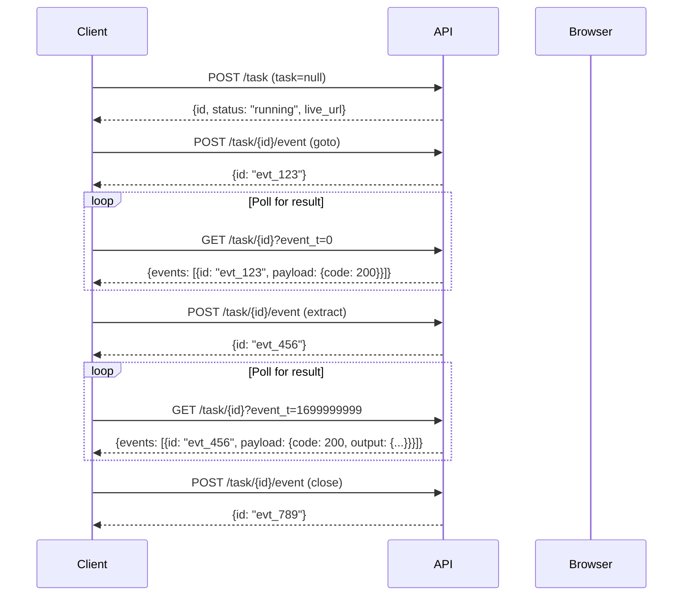

Sessions allow you to maintain a persistent browser instance and perform multiple actions sequentially. This is useful for complex workflows like logging in, navigating, and extracting data across multiple pages.

## How Sessions Work

1. **Create a session** by calling `POST /task` with `task=null`
2. **Send actions** via `POST /task/{task_id}/event`
3. **Poll for results** via `GET /task/{task_id}?event_t={timestamp}`
4. **Close the session** by sending a `close` event



## Step 1: Create a Session

Create a session by submitting a task with `task=null`. The browser will open and wait for actions.

```bash
curl -X POST "https://api.smooth.sh/api/v1/task" \
     -H "Content-Type: application/json" \
     -H "apikey: YOUR_API_KEY" \
     -d '{
       "task": null,
       "url": "https://example.com",
       "device": "desktop"
     }'
```

**Response:**

```json
{
  "r": {
    "id": "task_abc123",
    "status": "running",
    "live_url": "https://live.smooth.sh/v/...",
    "output": null
  }
}
```

Save the `id` - you'll use it for all subsequent actions.

## Step 2: Send Actions

Use the Event endpoint to send actions to your session. Each action requires:
- `name`: The event type (`browser_action` or `session_action`)
- `payload`: Contains the action name and input parameters
- `id`: A unique ID to match the response (use any unique string like UUID)

### Navigate to a URL

```bash
curl -X POST "https://api.smooth.sh/api/v1/task/task_abc123/event" \
     -H "Content-Type: application/json" \
     -H "apikey: YOUR_API_KEY" \
     -d '{
       "name": "browser_action",
       "payload": {
         "name": "goto",
         "input": {
           "url": "https://example.com/login"
         }
       },
       "id": "evt_goto_001"
     }'
```

### Run a Task (Agent-powered)

Execute an AI-powered task within the session:

```bash
curl -X POST "https://api.smooth.sh/api/v1/task/task_abc123/event" \
     -H "Content-Type: application/json" \
     -H "apikey: YOUR_API_KEY" \
     -d '{
       "name": "session_action",
       "payload": {
         "name": "run_task",
         "input": {
           "task": "Log in with username test@example.com and password secret123",
           "max_steps": 32
         }
       },
       "id": "evt_login_001"
     }'
```

### Extract Data

Extract structured data from the current page:

```bash
curl -X POST "https://api.smooth.sh/api/v1/task/task_abc123/event" \
     -H "Content-Type: application/json" \
     -H "apikey: YOUR_API_KEY" \
     -d '{
       "name": "browser_action",
       "payload": {
         "name": "extract",
         "input": {
           "schema": {
             "type": "object",
             "properties": {
               "username": {"type": "string"},
               "email": {"type": "string"},
               "plan": {"type": "string"}
             }
           },
           "prompt": "Extract the user profile information"
         }
       },
       "id": "evt_extract_001"
     }'
```

### Execute JavaScript

Run custom JavaScript in the browser:

```bash
curl -X POST "https://api.smooth.sh/api/v1/task/task_abc123/event" \
     -H "Content-Type: application/json" \
     -H "apikey: YOUR_API_KEY" \
     -d '{
       "name": "browser_action",
       "payload": {
         "name": "evaluate_js",
         "input": {
           "js": "return document.title"
         }
       },
       "id": "evt_js_001"
     }'
```

## Step 3: Poll for Results

After sending an action, poll the task endpoint to receive the result. Use the `event_t` parameter to only receive new events.

```bash
curl -X GET "https://api.smooth.sh/api/v1/task/task_abc123?event_t=0" \
     -H "apikey: YOUR_API_KEY"
```

**Response with action result:**

```json
{
  "r": {
    "id": "task_abc123",
    "status": "running",
    "events": [
      {
        "id": "evt_extract_001",
        "name": "browser_action",
        "payload": {
          "code": 200,
          "output": {
            "username": "john_doe",
            "email": "john@example.com",
            "plan": "Pro"
          }
        },
        "timestamp": 1699999999999
      }
    ]
  }
}
```

**Understanding the response:**
- `code: 200` - Action succeeded, `output` contains the result
- `code: 400` - Bad request, `output` contains error message
- `code: 500` - Internal error, `output` contains error message

For the next poll, use the last event's `timestamp`:

```bash
curl -X GET "https://api.smooth.sh/api/v1/task/task_abc123?event_t=1699999999999" \
     -H "apikey: YOUR_API_KEY"
```

## Step 4: Close the Session

When finished, close the session to release resources:

```bash
curl -X POST "https://api.smooth.sh/api/v1/task/task_abc123/event" \
     -H "Content-Type: application/json" \
     -H "apikey: YOUR_API_KEY" \
     -d '{
       "name": "session_action",
       "payload": {
         "name": "close"
       },
       "id": "evt_close_001"
     }'
```

## Complete Example: Login and Extract Data

Here's a complete workflow that logs into a website and extracts user data:

```javascript
const API_KEY = 'YOUR_API_KEY';
const BASE_URL = 'https://api.smooth.sh/api/v1';

async function request(method, path, body = null) {
  const response = await fetch(`${BASE_URL}${path}`, {
    method,
    headers: {
      'apikey': API_KEY,
      'Content-Type': 'application/json'
    },
    body: body ? JSON.stringify(body) : null
  });
  return response.json();
}

async function sendEvent(taskId, event) {
  return request('POST', `/task/${taskId}/event`, event);
}

async function pollForResult(taskId, eventId, lastEventT = 0) {
  while (true) {
    const { r: task } = await request('GET', `/task/${taskId}?event_t=${lastEventT}`);

    if (task.status !== 'running' && task.status !== 'waiting') {
      throw new Error(`Task ended with status: ${task.status}`);
    }

    if (task.events) {
      for (const event of task.events) {
        if (event.id === eventId) {
          if (event.payload.code === 200) {
            return { result: event.payload.output, lastEventT: event.timestamp };
          } else {
            throw new Error(event.payload.output);
          }
        }
      }
      // Update timestamp for next poll
      lastEventT = task.events[task.events.length - 1].timestamp;
    }

    await new Promise(r => setTimeout(r, 1000));
  }
}

async function main() {
  // 1. Create session
  console.log('Creating session...');
  const { r: session } = await request('POST', '/task', {
    task: null,
    url: 'https://example.com',
    device: 'desktop'
  });
  const taskId = session.id;
  console.log(`Session created: ${taskId}`);
  console.log(`Live URL: ${session.live_url}`);

  let lastEventT = 0;

  // 2. Navigate to login page
  console.log('Navigating to login...');
  const gotoId = 'evt_goto_' + Date.now();
  await sendEvent(taskId, {
    name: 'browser_action',
    payload: { name: 'goto', input: { url: 'https://example.com/login' } },
    id: gotoId
  });
  const gotoResult = await pollForResult(taskId, gotoId, lastEventT);
  lastEventT = gotoResult.lastEventT;
  console.log('Navigation complete');

  // 3. Run login task
  console.log('Logging in...');
  const loginId = 'evt_login_' + Date.now();
  await sendEvent(taskId, {
    name: 'session_action',
    payload: {
      name: 'run_task',
      input: {
        task: 'Fill in the login form with email "test@example.com" and password "secret123", then click the login button',
        max_steps: 16
      }
    },
    id: loginId
  });
  const loginResult = await pollForResult(taskId, loginId, lastEventT);
  lastEventT = loginResult.lastEventT;
  console.log('Login complete:', loginResult.result);

  // 4. Extract user data
  console.log('Extracting user data...');
  const extractId = 'evt_extract_' + Date.now();
  await sendEvent(taskId, {
    name: 'browser_action',
    payload: {
      name: 'extract',
      input: {
        schema: {
          type: 'object',
          properties: {
            username: { type: 'string' },
            email: { type: 'string' },
            accountType: { type: 'string' }
          }
        },
        prompt: 'Extract the logged-in user profile information'
      }
    },
    id: extractId
  });
  const extractResult = await pollForResult(taskId, extractId, lastEventT);
  console.log('Extracted data:', extractResult.result);

  // 5. Close session
  console.log('Closing session...');
  const closeId = 'evt_close_' + Date.now();
  await sendEvent(taskId, {
    name: 'session_action',
    payload: { name: 'close' },
    id: closeId
  });
  console.log('Session closed');
}

main().catch(console.error);
```

## Action Reference

| Action | Event Type | Payload | Description |
|--------|-----------|---------|-------------|
| `goto` | `browser_action` | `{name: "goto", input: {url}}` | Navigate to a URL |
| `extract` | `browser_action` | `{name: "extract", input: {schema, prompt?}}` | Extract structured data |
| `evaluate_js` | `browser_action` | `{name: "evaluate_js", input: {js, args?}}` | Execute JavaScript |
| `run_task` | `session_action` | `{name: "run_task", input: {task, max_steps?, ...}}` | Run an AI-powered task |
| `close` | `session_action` | `{name: "close"}` | Close the session |

## Using the Python SDK

The SDK handles all the polling complexity for you:

```python
from smooth import SmoothClient

client = SmoothClient(api_key="YOUR_API_KEY")

with client.session(url="https://example.com") as session:
    # Navigate
    session.goto("https://example.com/login")

    # Run a task
    result = session.run_task(
        task="Log in with test@example.com and password secret123",
        max_steps=16
    )
    print(f"Login result: {result.output}")

    # Extract data
    data = session.extract(
        schema={
            "type": "object",
            "properties": {
                "username": {"type": "string"},
                "email": {"type": "string"}
            }
        },
        prompt="Extract user profile information"
    )
    print(f"Extracted: {data.output}")

    # Execute JavaScript
    title = session.evaluate_js("return document.title")
    print(f"Page title: {title.output}")
```
