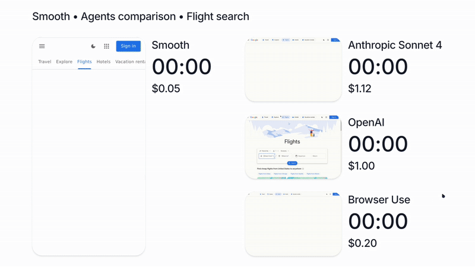

## Free API credits

Unlock your free credits and get a free API key.

<Card
  title="Get your free API key"
  icon="key"
  href="https://app.smooth.sh"
  horizontal
>
  Unlock your free welcome credits. No credit card required.
</Card>

## WebVoyager

Smooth is the most accurate browser agent on WebVoyager while also being 5x faster and 7x cheaper than Browser Use.

## Alternatives

We found that existing solutions are:

- **Too expensive** Usually require large models - can easily end up costing a few dollars even for simple tasks.
- **Too slow** Can take way too long to complete - e.g. 4 min to book a flight.
- **Unreliable** Even when provided with detailed instructions, they can struggle to complete the task.

The ultimate test is trying first-hand. We encourage you to try Smooth for free in our [Playground](https://app.smooth.sh).

## Community

<Card
  title="Join Discord"
  icon="discord"
  href="https://discord.gg/VcdgMwUmMG"
>
  Join our community for support and showcases
</Card>
